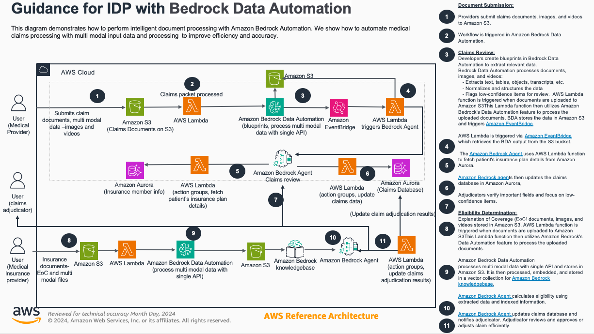

# Guidance for Multimodal Data Processing Using Amazon Bedrock Data Automation
Automate document processing using AWS AI/ML services to:
- Speed up business processes
- Improve decision quality 
- Reduce operational costs
- Free up expert resources for high-value tasks
cd
This solution uses Amazon Bedrock's Generative AI capabilities to:
1. Classify documents
2. Extract content
3. Process information using foundation models

  
Note on dataset and Acceptable End User Policy from the model provider

The dataset utilized in this guidance consists entirely of synthetic data. This artificial data is designed to mimic real-world information but does not contain any actual personal or sensitive information.

For use cases related to finance and medical insurance as used in this guidance:

Users must adhere to the model provider's Acceptable Use Policy at all times. This policy governs the appropriate use of the synthetic data and associated models, and compliance is mandatory.This synthetic data is provided for testing, development, and demonstration purposes only. It should not be used as a substitute for real data in making financial or medical decisions affecting individuals or organizations.
By using this dataset and guidance, you acknowledge that you have read, understood, and agree to comply with all applicable terms, conditions, and policies set forth by the model provider.

## Table of Contents

- [Architecture and Key Features](#architecture-and-key-features)
  - [Part A: Automated Lending Flow](#part-a-automated-lending-flow)
  - [Part B: Intelligent Claims Review](#part-b-intelligent-claims-review)
- [Getting Started](#getting-started)
  - [Prerequisites](#prerequisites)
  - [Quick Start Guide](#quick-start-guide)
- [Cost Estimation](#cost-estimation)
- [Important Notes](#important-notes)
- [Legal Notice](#legal-notice)
- [Authors](#authors)

## Architecture and Key Features

### Part A: Automated Lending Flow

- Uses Amazon Bedrock Data Automation (BDA) for document processing
- Creates reusable document blueprints
- Automatically detects document types
- Extracts relevant information
- Processes results downstream

### Part B: Intelligent Claims Review
- Processes insurance documents
- Stores extracted content in Bedrock Knowledge Base
- Uses RAG (Retrieval Augmented Generation) for accurate responses
- Employs Bedrock Agent to determine claim eligibility
- Updates claims database automatically

## Getting Started

### Prerequisites
1. Active AWS Account ([Create one here](https://aws.amazon.com/resources/create-account/))
2. AWS CLI ([Installation guide](https://docs.aws.amazon.com/cli/latest/userguide/getting-started-install.html))
3. AWS CDK CLI ([Installation guide](https://docs.aws.amazon.com/cdk/v2/guide/getting_started.html))

### Quick Start Guide

#### Lending Flow Setup
1. [Deploy lending flow stack](deployment/docs/a_lending_01_deployment.md)
2. [Configure BDA project & blueprints](deployment/docs/a_lending_02_setup_blueprints.md)
3. [Process lending documents](deployment/docs/a_lending_03_run_flow.md)

#### Claims Review Setup
1. [Create BDA blueprint](deployment/docs/b_claims_review_03_create_blueprint.md)
2. [Deploy claims review stack](deployment/docs/b_claims_review_01_deploy.md)
3. [Process claims](deployment/docs/b_claims_review_02_run_flow.md)

## Cost Estimation
- Approximate cost: $XX/month for 1,000 pages (US East Region, December 2024)
- Recommend setting up [AWS Budget](https://docs.aws.amazon.com/cost-management/latest/userguide/budgets-managing-costs.html)

### Cost Breakdown

Below you can see th estimated costs of the guidance solution and the assumptions.

#### Flow A: Lending Flow

| AWS service                                                          | Dimensions                                                                                                                                                                                                                              | Cost [USD]      |
|----------------------------------------------------------------------|-----------------------------------------------------------------------------------------------------------------------------------------------------------------------------------------------------------------------------------------|-----------------|
| Amazon Bedrock Data Automation                                       | 1,000 documents processed with Bedrock Data Automation                                                                                                                                                                                  | $ 40            |
| AWS Lambda                                                           | 3,000 requests per month on x86 with 512 MB ephemeral storage, 30s execution time                                                                                                                                                       | $ 0.19          |
| Amazon EventBridge                                                   | 1 million events                                                                                                                                                                                                                        | $ 1.00          |
| Amazon Simple Storage Service (S3)                                   | S3 Standard storage (10 GB per month)                                                                                                                                                                                                   | $ 0.24     |

#### Flow B: 

| AWS service                                                          | Dimensions                                                                                                                                                                                                                              | Cost [USD]      |
|----------------------------------------------------------------------|-----------------------------------------------------------------------------------------------------------------------------------------------------------------------------------------------------------------------------------------|-----------------|
| Amazon Bedrock Data Automation                                       | 1,000 documents processed with Bedrock Data Automation                                                                                                                                                                                  | $ 40            |
| Amazon Bedrock Knowledgebase - Embeddings (Titan Text Embeddings v2) | 100 documents, each 10MB of text, Total 1GB, ingested once                                                                                                                                                                              | $ 17  (one-time) |
| Amazon Bedrock Knowledgebase - OpenSearch Serverless                 | Minimum OCU: 1, Expected OCU hours per day: 24                                                                                                                                                                                          | $ 350           |
| Amazon Bedrock Agent - Titan Text Premier                            | 1,000 documents (each 2 pages), each flow requiring 5 agent steps with each 3.5K input tokens, 200 output tokens, total: input tokens 17.5K x 1000 documents (8.75 USD), output tokens: 1K x 1000 documents (1.50 USD), $0.0005	$0.0015 | $ 10.25         |
| AWS Lambda                                                           | 3,000 requests per month on x86 with 512 MB ephemeral storage, 30s execution time                                                                                                                                                       | $ 0.19          |
| Amazon EventBridge                                                   | 1 million events                                                                                                                                                                                                                        | $ 1.00          |
| Amazon Simple Storage Service (S3)                                   | S3 Standard storage (10 GB per month)                                                                                                                                                                                                   | $ 0.24     |
| Amazon Aurora                                                        | Minimum Aurora capacity units: 2 capacity units, Maximum Aurora capacity units: 8 capacity units                                                                                                                                        | $ 176.73        |

## Important Notes

### Data Usage
- Solution uses synthetic data only
- No real personal/sensitive information included
- For testing/development purposes only

### Regional Availability

This guidance can be deployed only to AWS regions which have these services available: 

- Amazon Bedrock
- Bedrock Data Exchange
- Bedrock Agents
- Other services noted above

### Service Quotas
Your AWS account has default quotas, also known as service limits, described [here](https://docs.aws.amazon.com/general/latest/gr/aws_service_limits.html). This guidance can be installed and tested within the default quotas for each of the services used. You can request increases for some quotas. Note that not all quotas can be increased.

To operate this guidance at scale, it is important to monitor your usage of AWS services and configure alarm settings to notify you when a quota is close to being exceeded. You can find details on visualizing your service quotas and setting alarms [here](https://docs.aws.amazon.com/AmazonCloudWatch/latest/monitoring/CloudWatch-Quotas-Visualize-Alarms.html).  

## Revisions

Document all notable changes to this project.

Consider formatting this section based on Keep a Changelog, and adhering to Semantic Versioning.

## Legal Notice

Customers are responsible for making their own independent assessment of the information in this Guidance. This Guidance: (a) is for informational purposes only, (b) represents AWS current product offerings and practices, which are subject to change without notice, and (c) does not create any commitments or assurances from AWS and its affiliates, suppliers or licensors. AWS products or services are provided “as is” without warranties, representations, or conditions of any kind, whether express or implied. AWS responsibilities and liabilities to its customers are controlled by AWS agreements, and this Guidance is not part of, nor does it modify, any agreement between AWS and its customers.

## Authors
* ...
* Arlind Nocaj
* ...

