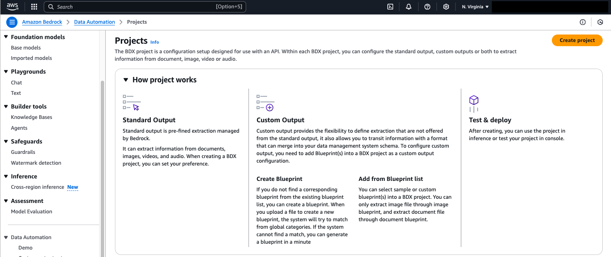
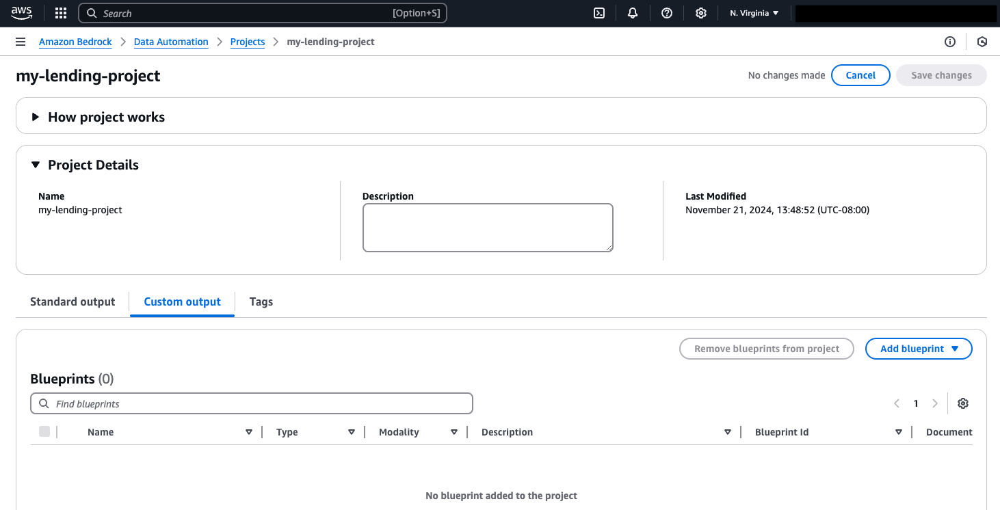
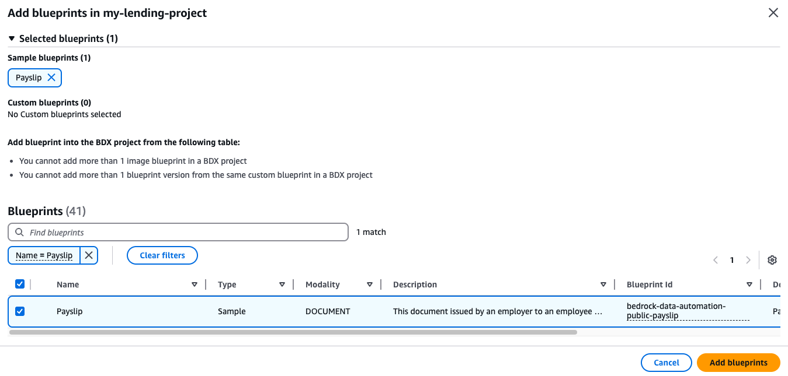
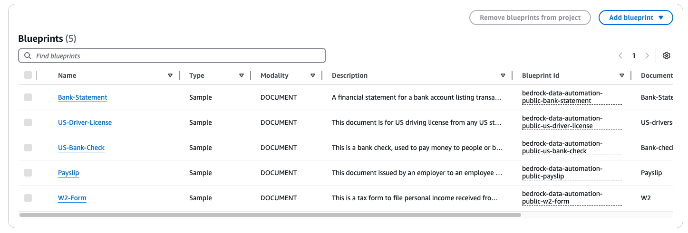
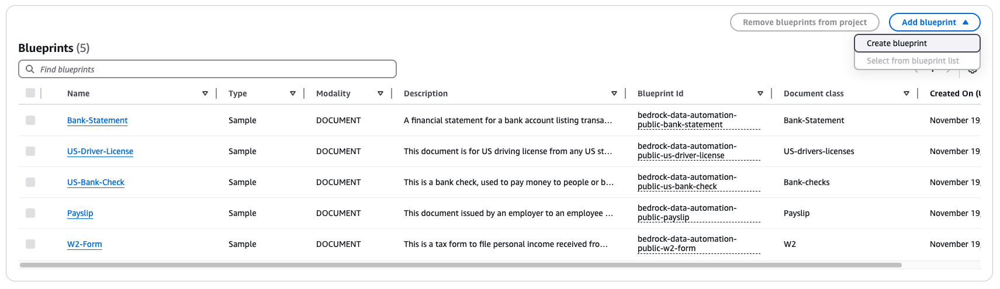
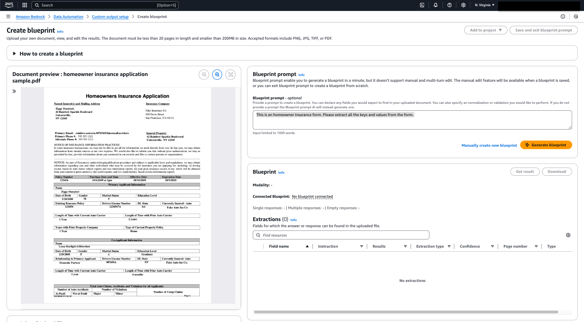
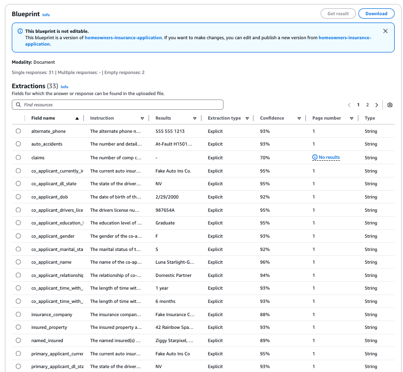
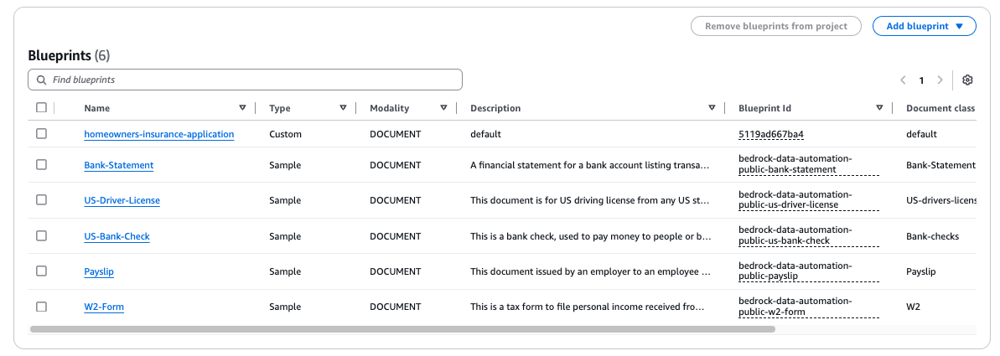
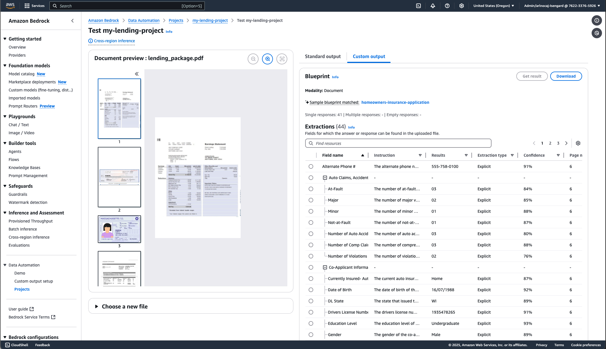

# Instructions to create a Blueprint Via the AWS Console

In this first use case, we will be processing a US lending application using Bedrock Data Automation (BDA). The application is a PDF file that contains several documents. We will use BDA to identify each document, and then to extract the data we need for downstream processing. 

1.  An Earning Statement (Pay Stub)
2.  A Check
3.  A drivers License
4.  A Bank Statement
5.  A W2 US Tax form
6.  A Homeowners Insurance Application

To get started, we will download the sample documents located in `/assets/data` folder to your load hard drive. 

* [Homeowners Insurance Application sample](https://github.com/aws-solutions-library-samples/guidance-for-multimodal-data-processing-using-amazon-bedrock-data-automation/blob/main/assets/data/homeowner_insurance_application_sample.pdf)
* [Lending package sample](https://github.com/aws-solutions-library-samples/guidance-for-multimodal-data-processing-using-amazon-bedrock-data-automation/blob/main/assets/data/lending_package.pdf)

We will next create a project within BDA. 

* Navigate to AWS Console
* Search for Bedrock in the "Services" search bar
* Once in the Bedrock console, click on the "Projects" menu under Data Automation.  
* Then click the “Create Project” button
* Name the project “my-lending-project”



Next we will add a set of standard blueprints to the project. These blueprints are provided by AWS out-of-the-box. These samples are of documents commonly seen in US Lending Applications. 

* click the “Edit” button on the project we just created
* Choose the ‘Custom Output’ tab, where we can see the Blueprints assigned to the project. 




* click the “Select from blueprint list” button. 
* Enter “Payslip” into the search box, to find the “Payslip” blueprint
* Select and click “Add blueprints”



Repeat the above steps to add these blueprints to the project: A Bank Statement, A US Drivers License, A Bank Check, and a W2 Tax Form. Your project show now have five blueprints and looks like this. 



To process our Lending Package, we need one more blueprint. BDA does not have a out-of-box blueprint for a Homeowners Insurance Application, so let’s create one. 

* Save the changes, to the project, click the “Save“ button and then ”Create Blueprint“




* Select the sample named “homeowner insurance application sample.pdf” for upload. Click the "Upload File" button.
* For an initial prompt, enter “This is an homeowner insurance form. Please extract all the keys and values from the form.”




* Click the “Generate Blueprint” button. BDA will read the sample file, extract the keys and values, and create a new reusable Blueprint for future Homeowners Insurance Application forms. 
* Name the blueprint “homeowners-insurance-application”
* Click “Add to Project” and “Add to existing project”, add add this new blueprint to our project named “my-lending-project”. 
* Click “Save and exit blueprint prompt”
* Examine the results from the blueprint. Note that BDA has read all the fields from the form. Depending on your initial prompt, you should see more than 40 fields extracted. If you see fewer than 40, you can tweak the wording of the initial prompt, or choose "Manually create blueprint" and specify each field you want to extract.

Note that BDA has also been able to distinguish the primary applicant from the co-applicant, for example extracting two Drivers License IDs: primary_applicant_drivers_license and co_applicant_drivers_license. Note on the original form these two fields have identical labels “Drivers License Number”. 



We now have a project with 6 blueprints. 

* Navigate to BDA, then “Projects”. Select the project named “my-lending-project”. 
* Choose the ‘Custom Output’ tab, where we can see the Blueprints assigned to the project. You’ll now see our project has six blueprints. If you don’t see six blueprints, please go back and retrace your steps. For the next activity, we need to have all the blueprints associated with our project. 



Now that we have our project with all the needed blueprints (six), we can proceed to process a “lending bundle” - i.e. a single PDF file with multiple pages, with six document categories. 


* Navigate to BDA, then “Projects”. Select the project named “my-lending-project”. 
* Click the "Test" button on the top right. 
* Upload the sample named “lending_package.pdf”. This package has six different documents in one file. 
    *  An Earning Statement (Pay Stub)
    *  A Check
    *  A drivers License
    *  A Bank Statement
    *  A W2 US Tax form
    *  A Homeowners Insurance Application. Note, this is a different application form, one that BDA has not seen before. 
* Click “Generate Results”. BDA will analyze each page, and find the Homeowners Insurance document, and apply the “homeowners-insurance-application” blueprint. 

Below we see a sample result of that.


The Document Splitting is disabled by default, lets activate it by running the following code:

```bash
# to be run from the deployment/ folder
python ../source/lending_flow/activate_document_splitting.py my-lending-project
```

This should result in the following output, which has the document splitter now enabled.

```bash
(.venv) ~/projects/guidance-for-multimodal-data-processing-using-amazon-bedrock-data-automation/deployment python ../source/lending_flow/activate_document_splitting.py my-lending-project
Get project list and find matching project for my-lending-project
Activating document splitting for project: my-lending-project, arn:aws:bedrock:us-west-2:626723862963:data-automation-project/8be4e4fd3f6f

Updated override configuration of project:
{
  "document": {
    "splitter": {
      "state": "ENABLED"
    }
  }
}


```
