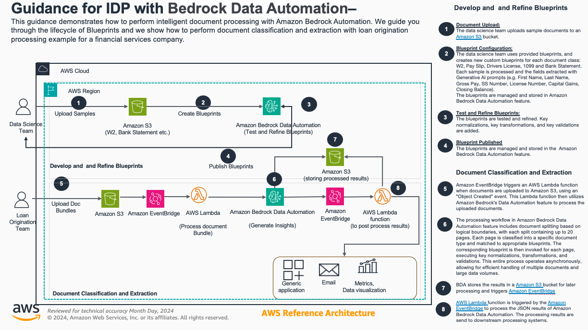

# Instructions For Using Blueprints To Process Loan Applications

You have now completed the install and setup of the solution to process Loan Applications. Our deployed solution has the components shown. If you have not completed this step, please go back and complete the deployment steps [here](https://github.com/aws-solutions-library-samples/guidance-for-multimodal-data-processing-using-amazon-bedrock-data-automation/blob/main/deployment/docs/a_lending_01_deployment.md) before proceeding. 



After installing, we used BDA in the Amazon Console to view  to access five sample blueprints we need for processing loan applications. We then add a new blueprints for a Homeowners Insurance Application form. If you have not completed this step, please go back and complete the setup steps [here](https://github.com/aws-solutions-library-samples/guidance-for-multimodal-data-processing-using-amazon-bedrock-data-automation/blob/main/deployment/docs/a_lending_02_setup_blueprints.md)

BDA is a generative-AI powered capability of Amazon Bedrock that enables you to automate your end-to-end Intelligent Document Processing (IDP) workflows quickly, accurately and at scale. A blueprint is a structural representation of your desired output for a specific document type (e.g. invoices, drivers licenses or IRS form 1099-INT). We then feed new unseen documents into the solution, for BDA to detect the document type, apply the correct blueprint and send the extracted results for downstream processing.

## Running the Guidance - Processing of a Lending Application Package

### Sample A

Steps:
1. Upload a [lending_package_w2.pdf](../../assets/data/lending_package_w2.pdf) to the S3 input bucket, e.g. similar to this `lending-flow-bucket43879c71-heddfpqsgwfj/documents/lending_package_w2.pdf`
2. Check for results in the S3 output bucket, e.g. similar like `lending-flow-bucket43879c71-heddfpqsgwfj/documents-output/`.

You can use the command below to copy the BDA result.
```bash
# Lets get the bucket name of your deployment
bucket_name=$(aws s3api list-buckets --query 'Buckets[?starts_with(Name, `lending-flow-bucket`)].[Name]' --output text)

# First, get the matching keys and format them for copying
aws s3api list-objects-v2 \
--bucket $bucket_name \
--prefix documents-output/lending_package_w2.pdf \
--query "Contents[?contains(Key, 'custom_output')].Key" \
--output text | \
xargs -I {} aws s3 cp s3://$bucket_name/{} ./results_w2.json
```

3. Review the `results_w2.json` that has been copied to your local directory.

### Sample B

We will now submit a new lending application to BDA. The workflow will process the lending application package, identifying the six documents in the package, and applying the appropriate Blueprint for each document. 

1.  An Earning Statement (Pay Stub)
2.  A Check
3.  A drivers License
4.  A Bank Statement
5.  A W2 US Tax form
6.  A Homeowners Insurance Application

Steps:
1. Upload a new [lending_package.pdf](../../assets/data/lending_package.pdf) to the S3 input bucket, e.g. similar to this `lending-flow-bucket43879c71-heddfpqsgwfj/documents/`
2. Check for results in the S3 output bucket in the AWS console, e.g. similar to `lending-flow-bucket43879c71-heddfpqsgwfj/documents-output/`.  

You can use the command below to copy the BDA result.
```bash

# Lets get the bucket name of your deployment
bucket_name=$(aws s3api list-buckets --query 'Buckets[?starts_with(Name, `lending-flow-bucket`)].[Name]' --output text)

# Lets copy the results to our local directory
aws s3 cp --recursive s3://$bucket_name/documents-output/lending_package.pdf ./results_lending_package/
```
3. List the local files:
```bash
find ./results_lending_package/ -name "result.json"
```
Resulting in 

```terminal
(.venv) ~/projects/guidance-...-automation/deployment $ `find ./results_lending_package/ -name "result.json"`
./results_lending_package//9f5f5fdc-4d7f-4210-8b84-34e173ea5e8c/0/custom_output/0/result.json
./results_lending_package//9f5f5fdc-4d7f-4210-8b84-34e173ea5e8c/0/custom_output/1/result.json
./results_lending_package//9f5f5fdc-4d7f-4210-8b84-34e173ea5e8c/0/custom_output/4/result.json
./results_lending_package//9f5f5fdc-4d7f-4210-8b84-34e173ea5e8c/0/custom_output/3/result.json
./results_lending_package//9f5f5fdc-4d7f-4210-8b84-34e173ea5e8c/0/custom_output/2/result.json
./results_lending_package//9f5f5fdc-4d7f-4210-8b84-34e173ea5e8c/0/custom_output/5/result.json
./results_lending_package//9f5f5fdc-4d7f-4210-8b84-34e173ea5e8c/0/standard_output/0/result.json
./results_lending_package//9f5f5fdc-4d7f-4210-8b84-34e173ea5e8c/0/standard_output/1/result.json
./results_lending_package//9f5f5fdc-4d7f-4210-8b84-34e173ea5e8c/0/standard_output/4/result.json
./results_lending_package//9f5f5fdc-4d7f-4210-8b84-34e173ea5e8c/0/standard_output/3/result.json
./results_lending_package//9f5f5fdc-4d7f-4210-8b84-34e173ea5e8c/0/standard_output/2/result.json
./results_lending_package//9f5f5fdc-4d7f-4210-8b84-34e173ea5e8c/0/standard_output/5/result.json
./results_lending_package//9f5f5fdc-4d7f-4210-8b84-34e173ea5e8c/job_metadata.json
```

4. Review each of the `result.json` that has been copied to your local directory. Each of them will contained the extracted and mapped information from a specific blueprint.

If you have `jq` installed you can also run the following command to see a partial output of e.g. the first JSON file 

```bash
find . -path "*/0/result.json" -exec jq '. | {matched_blueprint, document_class, split_document, inference_result} | with_entries(select(.value != null))' {} \;
```
 
Below you can find an excerpt of how the result will look like for the Payslip blueprint.

```
{
  "matched_blueprint": {
    "arn": "arn:aws:bedrock:us-west-2:aws:blueprint/bedrock-data-automation-public-payslip",
    "name": "Payslip",
    "confidence": 0.9992658
  },
  "document_class": {
    "type": "Payslip"
  },
  "split_document": {
    "page_indices": [
      0
    ]
  },
  "inference_result": {
    ...
    "PayPeriodEndDate": "2008-07-18",
    "PayDate": "2008-07-25",
    "currency": "USD",
    "EmployeeAddress": {
      "State": "USA",
      "ZipCode": "12345",
      "City": "ANYTOWN",
      "Line1": "101 MAIN STREET",
      "Line2": ""
    },
    "YTDGrossPay": 23526.8,
    "is_gross_pay_valid": "",
    "StateFilingStatus": "",
    "YTDCityTax": 308.88,
    "EmployeeNumber": "",
    "RegularHourlyRate": 10,
    "are_field_names_sufficient": false,
    "YTDTotalDeductions": "",
    "is_ytd_gross_pay_highest": true,
    "StateTaxes": [
      {
        "YTD": 438.36,
        "Period": 8.43,
        "ItemDescription": "NY State Income Tax"
      }
    ],
    ...
  }
}
```
