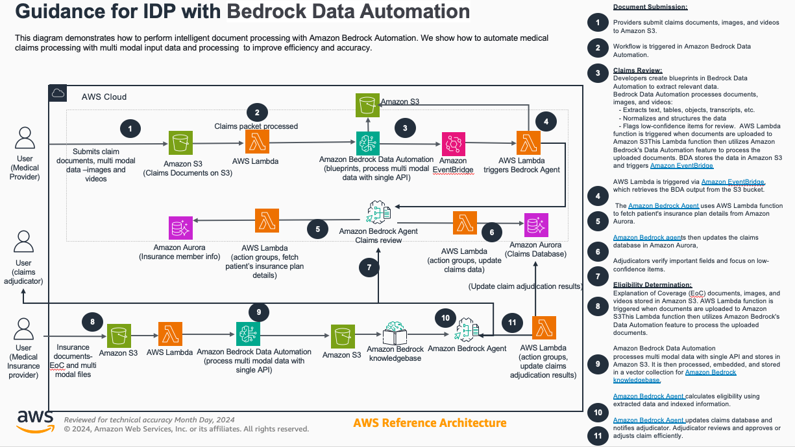
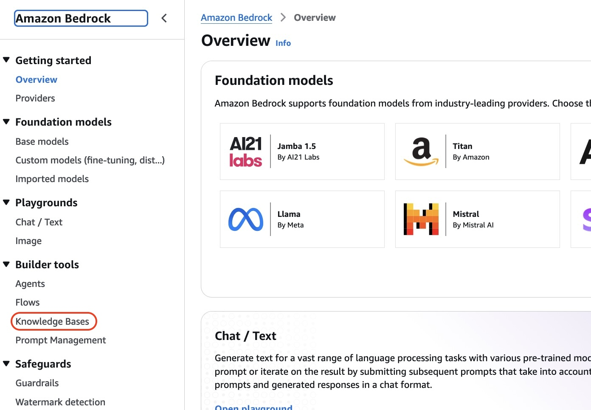

# Instructions For Using Blueprints To Process Medical Insurance Claims

In the second flow, we will submit documents that will be processed and the extracted contents stored in an Amazon Bedrock Knowledge Base, to create a Retrieval Augmented Generation (RAG) database.  We will then build a Bedrock Agent to process an insurance claim. The agent will use Generative AI to determine the eligibility of the claim, and update the claims database.

You have now completed the install and setup of the solution to process Insurance Claims. Our deployed solution has the components shown. If you have not completed this step, please go back and complete the deployment steps [here](./deployment-claims-review-agent.md) before proceeding. 

BDA is a generative-AI powered capability of Amazon Bedrock that enables you to automate your end-to-end Intelligent Document Processing (IDP) workflows quickly, accurately and at scale. A blueprint is a structural representation of your desired output for a specific document type (e.g. invoices, drivers licenses or IRS form 1099-INT). We then feed new unseen documents into the solution, for BDA to detect the document type, apply the correct blueprint and send the extracted results for downstream processing.

## Accessing the Insurance EOC Knowledge Base

In this step, we will use Bedrock in the AWS Console to view and access the Insurance EOC Knowledge Base. We will use the console to issue prompts 

1. Open the Amazon Bedrock Console and Click on `Knowledge Bases` under `Builder Tools` in the the sidebar to navigate to the Knowledge Bases view

2. In the Knowledge Bases view, select the Knowledge Base named `claims-eoc-kb` and click on `Test Knowledge Base`

## Processing of a Medical Insurance Claims

We will now submit a new lending application to BDA. BDA will process the insurance claim, and check for coverage against the EOC documents in the Knowledge Base. 

Steps:
1. Upload a new lending package to the S3 input bucket. 
2. Check for results RDS. 

We also need debug instructions (CloudWatch, Lamnda moniror, etc) of the expected results are not generated. 